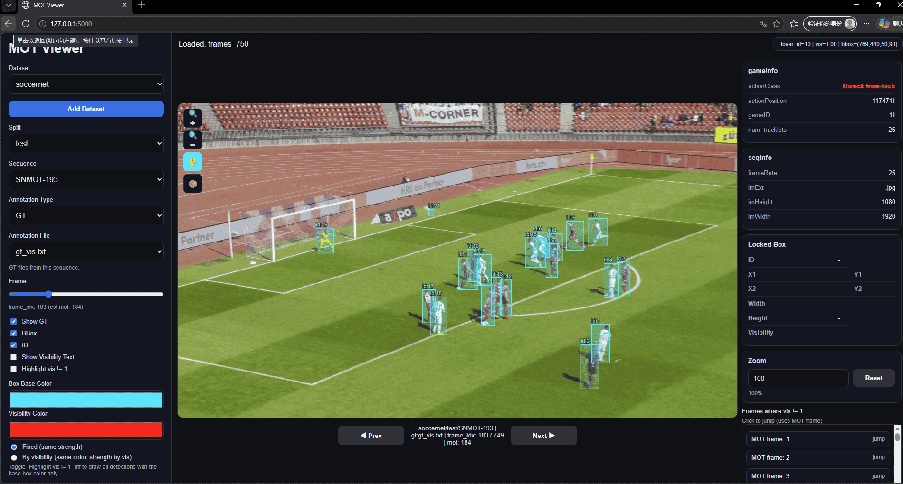

# MOT Viewer

A lightweight Flask-based viewer for inspecting Multi-Object Tracking (MOT) datasets.



## Overview

MOT Viewer provides a simple browser interface for inspecting tracking datasets without writing custom visualization scripts. It is designed for quick validation of dataset structure, annotation quality, and sequence-level consistency.

The viewer supports common MOT-style datasets such as SoccerNet-Tracking and DanceTrack, and can be easily extended to custom datasets through a configuration file or the web interface.

## Features

- Browse MOT image sequences frame by frame
- Visualize bounding boxes and track IDs
- Switch between multiple datasets in the browser
- Register new datasets without modifying source code
- Configure dataset-specific layouts (splits, folders, filenames)
- Store local dataset configurations separately via `instance/`

## Supported Datasets

| Dataset | Description | URL |
| --- | --- | --- |
| SoccerNet-Tracking | Soccer broadcast video dataset for multi-object tracking (SoccerNet challenge) | https://github.com/SoccerNet/sn-tracking |
| DanceTrack | Multi-human tracking dataset with similar appearance and complex motion | https://dancetrack.github.io/ |

Other MOT-style datasets can be added as long as their structure and annotations are compatible.

## Installation

### 1. Clone the repository

```bash
git clone https://github.com/shijunjie07/mot-viewer.git
cd mot-viewer
````

### 2. Create environment

```bash
conda create -n mot-viewer python=3.11 -y
conda activate mot-viewer
```

### 3. Install dependencies

```bash
pip install -e .
```

## Run

```bash
python app.py
```

Open in browser:

```
http://127.0.0.1:5000
```

## Dataset Configuration

By default, dataset definitions are stored in:

```
instance/datasets.json
```

This file is used for **local configuration only** and is typically excluded from version control.

To override the path:

```bash
export MOT_VIEWER_DATASETS_CONFIG=/path/to/datasets.json
```

## Adding Custom Datasets

### Option 1: Web UI

Use the **Add Dataset** button in the viewer and provide:

* Dataset root path
* Available splits
* Optional folder / filename settings

### Option 2: JSON Configuration

Edit `instance/datasets.json` manually:

```json
{
  "datasets": [
    {
      "name": "my_dataset",
      "root": "/path/to/my_dataset",
      "splits": ["train", "val", "test"],
      "image_dir": "img1",
      "gt_files": ["gt.txt"],
      "seqinfo_filename": "seqinfo.ini",
      "gameinfo_filename": "gameinfo.ini"
    }
  ]
}
```

Datasets are loaded at startup, and changes from the UI are written back to this file.

## Expected Dataset Structure

Default MOT-style layout:

```
<dataset-root>/
  <split>/
    <sequence>/
      img1/
        000001.jpg
        000002.jpg
        ...
      gt/
        gt.txt
      seqinfo.ini       # optional
      gameinfo.ini      # optional
```

### Notes

* `img1/` is the default image directory
* `gt/` contains annotation files
* `seqinfo.ini` and `gameinfo.ini` are optional
* Ground-truth defaults to `gt.txt`
* Custom layouts can be configured during dataset registration

## Annotation Format

Expected format follows MOTChallenge style:

```
frame,id,x,y,w,h,confidence,class,unused
```

Key fields used by the viewer:

| Field      | Description    |
| ---------- | -------------- |
| frame      | Frame index    |
| id         | Track identity |
| x, y, w, h | Bounding box   |

Additional columns are ignored if present.

## Use Cases

* Validate tracking annotations before training
* Check alignment between frames and labels
* Compare annotation quality across datasets
* Debug dataset conversion pipelines

## Repository Notes

* `instance/` is for local configuration and should not be committed
* Assets for documentation should be placed in `docs/assets/`

## License

This project is licensed under the MIT License. See the [LICENSE](LICENSE) file for details.
